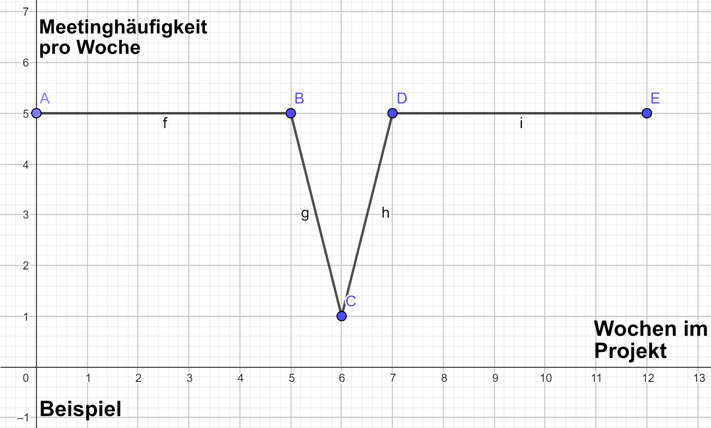
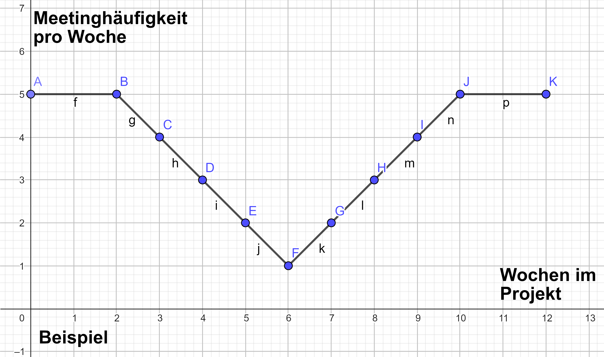
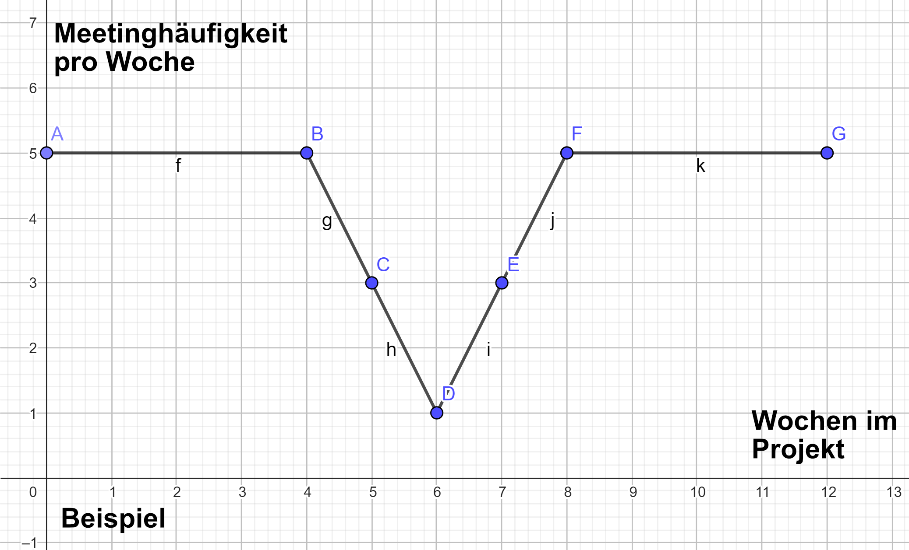
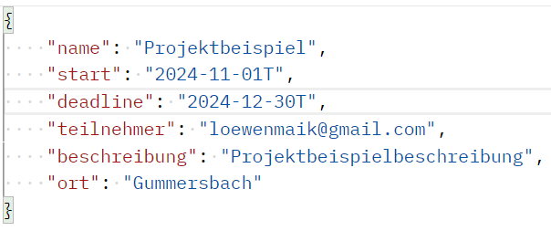
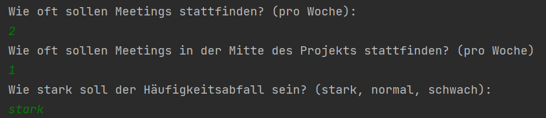
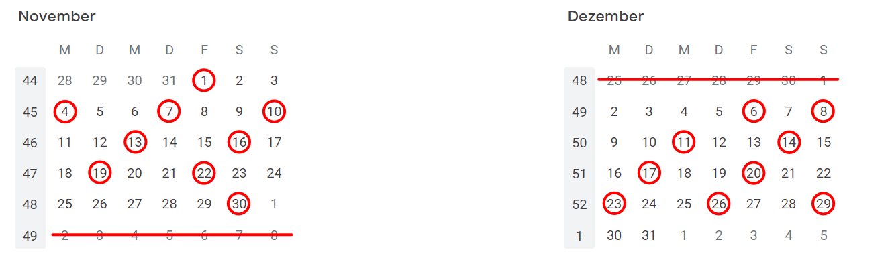
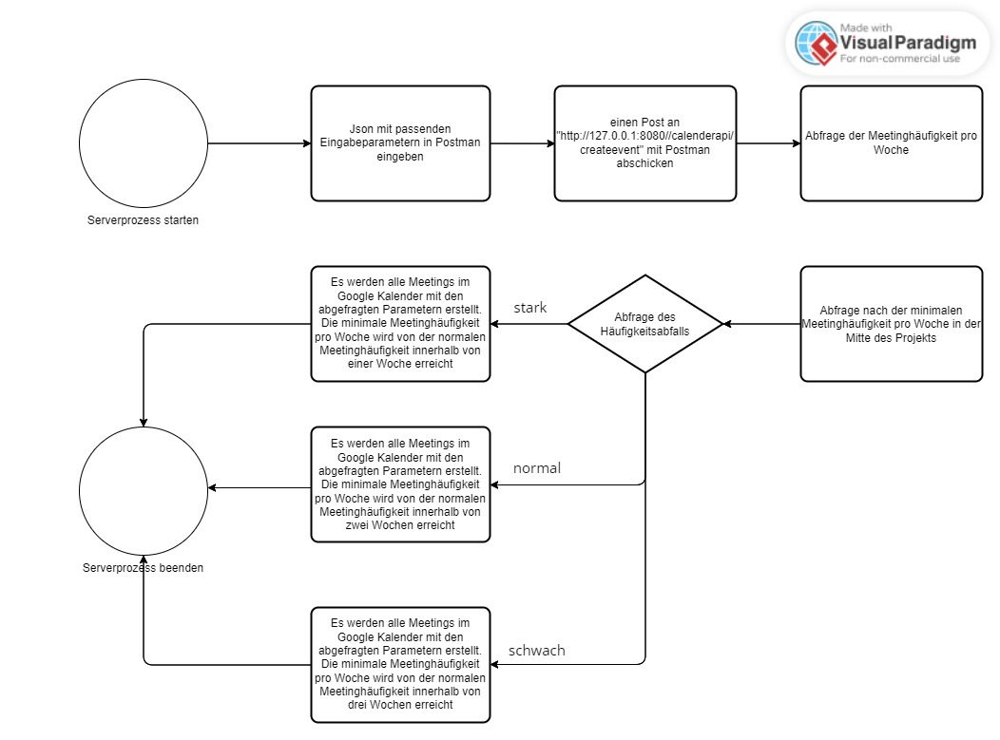
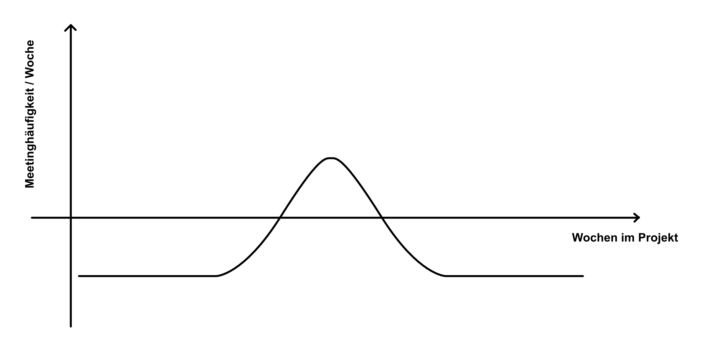
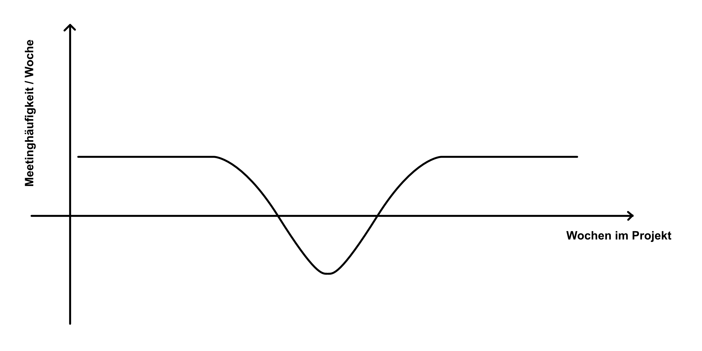

# Informatik Projekt: Kalender Feature zur Optimierung der Terminplanung in Softwareprojekt Teams

## Einleitung

Viele Teams setzen auf die Scrum-Methodik und regelmäßig wiederkehrende Meetings, die zuvor fest eingeplant sind. Doch stellt sich die Frage, ob diese Vorgehensweise heutzutage tatsächlich die effizienteste Art und Weise darstellt, um Meetings abzuhalten und Projekte umzusetzen. Wir sind der Auffassung, dass dies nicht der Fall ist und möchten daher einen innovativen Ansatz für die Organisation von Meetings in agilen Projekten vorstellen.

## Problemstellung

* Hoher Organisationsaufwand bei Terminplanung für Meetings in Softwareprojekten

  * Projektmanager verwenden im Durchschnitt 80% ihrer Arbeitszeit auf die Abstimmung von Projekten, insbesondere auf die Terminplanung [1]
  * Mitarbeiter verbringen im Durchschnitt 31 Stunden pro Monat in unproduktiven Meetings [5]
  * Implementierung eines Kalender Features zur Optimierung der Terminplanung möglich
* Individuelle Verfügbarkeit der Teammitglieder als Herausforderung

  * Teammitglieder haben unterschiedliche Arbeitszeiten und Verpflichtungen [4]
  * Fast 60% der Teammitglieder haben Schwierigkeiten, Meetings aufgrund von Zeitplan-Konflikten wahrzunehmen [2]
  * Kalender Feature, das individuelle Verfügbarkeiten berücksichtigt, könnte helfen
* Projektdauer oft nicht in Terminplanung einbezogen

  * Nur 28% der IT-Projekte werden innerhalb des geplanten Budgets und innerhalb der geplanten Zeit abgeschlossen [3]
  * Kalender Feature, das die Projektdauer berücksichtigt, könnte zu realistischerer Terminplanung und höherer Erfolgsquote beitragen
* Statische Meeting Frequenz bei Scrum und ähnlichen Arbeitsmethoden

  * 65% der Befragten gaben an, dass Meetings oft ihre Arbeit behindern, weil sie wichtige Aufgaben und Projekte vernachlässigen müssen [2]
  * Kalender Feature, das flexible Meeting Frequenz ermöglicht, könnte zu höherem Erfolg von IT-Projekten und Mitarbeiterzufriedenheit beitragen

[1] Project Management Institute (PMI). (2018). Pulse of the Profession. URL: https://www.pmi.org/-/media/pmi/documents/public/pdf/learning/thought-leadership/pulse/pulse-of-the-profession-2018.pdf
[2] Harvard Business Review. (2017). Stop the Meeting Madness. URL: https://hbr.org/2017/07/stop-the-meeting-madness
[3] Standish Group. (2015). Chaos Report. URL: [https://www.standishgroup.com/](https://www.standishgroup.com/sample_research_files/CHAOSReport2015-Final.pdf
)
[4] Atlassian. (n.d.). Time Wasting at Work Infographic. URL: https://www.atlassian.com/time-wasting-at-work-infographic

## Lösungsansatz (Idee)

* Fokus auf Herausforderungen bei der Planung von Meetings während des gesamten Projektablaufs
  * Laut Kogon et al. (2015) sind Meetings eine wichtige Möglichkeit, um sicherzustellen, dass alle Projektbeteiligten das Problem und die Anforderungen verstehen [3].
* Zu Beginn des Projekts erhöhte Anzahl von Meetings zur Sicherstellung des Verständnisses aller Projektbeteiligten für das Problem und die Anforderungen
  * Kerzner (2017) empfiehlt, dass in der Anfangsphase des Projekts mehr Zeit für die Planung und die Koordination der Meetings aufgewendet wird, um sicherzustellen, dass das Team auf einem gemeinsamen Verständnis des Projekts aufbauen kann [2].
* In der Mitte des Projekts nimmt die Anzahl der Meetings ab, da Rollen und Aufgaben klar definiert sind
  * Wysocki (2013) betont, dass in der Mitte des Projekts die Aufgabenverteilung und die Rollen der Teammitglieder geklärt sein sollten, was die Anzahl der Meetings reduzieren kann [4].
* Am Ende des Projekts nimmt die Anzahl der Meetings wieder zu, um die Deadline einzuhalten und die Ergebnisse abzuschließen
  * Gray und Larson (2018) weisen darauf hin, dass gegen Ende des Projekts der Zeitdruck zunimmt, was zu einem Anstieg der Meetings führen kann, um sicherzustellen, dass die Deadline eingehalten wird [1].
* Implementierung einer Visualisierung der Meeting-Häufigkeit in Form einer umgekehrten Glockenkurve, die je nach Bedarf gestaucht oder gestreckt werden kann, um die Anzahl der Meetings während jeder Projektphase zu optimieren
  * Laut Wysocki (2013) kann die Visualisierung von Daten helfen, die Planung von Meetings zu optimieren und zu vereinfachen [4].
* Automatisierung der Meeting-Erstellung für jeden Projektbeteiligten im Kalender, unter Berücksichtigung individueller Verfügbarkeiten der Teammitglieder
  * Kerzner (2017) betont, dass die Automatisierung von Aufgaben wie der Meeting-Erstellung helfen kann, Zeit zu sparen und die Effizienz des Teams zu verbessern [2].

[1] Gray, C. F., & Larson, E. W. (2018). Project Management: The Managerial Process. New York, NY: McGraw-Hill Education.
[2] Kerzner, H. (2017). Project Management: A Systems Approach to Planning, Scheduling, and Controlling. Hoboken, NJ: John Wiley & Sons.
[3] Kogon, K., Blakemore, S., & Wood, J. (2015). Project Management for the Unofficial Project Manager. Hoboken, NJ: John Wiley & Sons.
[4] Wysocki, R. K. (2013). Effective Project Management: Traditional, Agile, Extreme. Hoboken, NJ: John Wiley & Sons.

## Zielsetzung

Zur Lösung der Problemstellung soll ein Kalender Feature entwickelt werden, das die Terminplanung in Softwareprojekt Teams optimiert. Dabei sollen individuelle Verfügbarkeiten der Teammitglieder berücksichtigt und die Meeting Frequenz flexibel an die Bedürfnisse des Teams angepasst werden können.

**Im Rahmen des Informatik Projekts soll ein erster Prototyp entwickelt werden, welcher die folgenden Funktionen haben soll:**

**Server mit Google Kalender API**

* Implementierung eines Servers, der die Google Kalender API nutzt.
* Der Benutzer soll Zugriffsberechtigungen auf sein Google Konto zulassen und ablehnen können.
* Die Daten sollen dabei vertraulich behandelt werden und der Benutzer soll sein Google Konto Passwort nicht für die Anwendung teilen müssen.

**Automatische Planung von Meetings durch eine konfigurierbare Heuristik**

* Implementierung einer Heuristik, die auf einer Annäherung an eine umgekehrte Gaußkurve basiert, um Meetings zu planen und automatisch durch den Server erstellen zu lassen.
* Die Heuristik soll dabei konfigurierbar sein und die verschiedenen Parameter für ein Projekt (wie z.B. Projektstart, Deadline, Teilnehmer) berücksichtigt werden.

## Konkurrenz Analyse

### Reclaim

* Reclaim ist eine Lösung zur automatisierten Kalenderplanung, die mithilfe von künstlicher Intelligenz arbeitet.
* Anwendung ermöglicht eine strukturierte Planung von Zeitfenstern in drei Kategorien:
  * Personal
  * Solo Work
  * Meetings
* es können Aufgaben auf ein Ziel hin geplant werden, indem der Gesamtzeitaufwand sowie der Zeitaufwand für jede Etappe definiert wird -> Software versucht dann die Etappe so nahtlos wie möglich in den Kalender zu integrieren
* Mindestpausenzeiten können zwischen Terminen festgelegt werden
* Gewohnheiten können in den Zeitplan integriert werden, indem ein bestimmter Rhythmus und Zeitaufwand definiert wird.
* Wiederkehrende Meetings zwischen zwei Personen mit Smart 1:1 zu planen -> Verfügbarkeitszeiten werden angegeben -> Software blockiert automatisch einen gemeinsamen Zeitraum für das Treffen, basierend auf anderen Terminen im Kalender

### Clockwise

* fortschrittliche Lösung zur automatisieren Planung von Besprechungen, die auf künstlicher Intelligenz basieren
* Optimiert flexibel geplante Meetings und Einzelgespräche
* Verschiebt Meetings zu den effizientesten Zeiten im Kalender und behebt Konflikte
* Arbeitet kalenderübergreifend und schafft Blöcke ununterbrochener Fokuszeit
* Versteht bevorzugte Arbeitszeiten und erkennt produktivste Zeiten
* Maßgeschneiderte Zeitpläne für individuelle Bedürfnisse
* Sofortiger Einblick in Bandbreite des Teams
* Überprüfung von Verfügbarkeit und Arbeitslast der Kollegen möglich
* Optimierung von Meetings und Arbeitsabläufen, um Zeit zu sparen und Produktivität zu steigern
* Wertvolle Ressource für Unternehmen zur Verbesserung von Effizienz und Zusammenarbeit

### Der Unterschied zu unserer Lösung

* Reclaim bietet nur Planung von wiederkehrenden Meetings für zwei Personen an
* Clockwise fokussiert auf Steigerung der persönlichen Produktivität, bietet keine wiederkehrenden Meetings für Teams an
* Unsere Hauptidee: wiederkehrende Meetings mit unterschiedlichen Häufigkeiten
* Dies ist unser Hauptunterscheidungsmerkmal von den Wettbewerbern

## Herangehensweise

### Technologie-Stack

* Verwendung der Google API ermöglicht Nutzung der Infrastruktur des Google Kalenders
* Google API unterstützt verschiedene Technologien wie Javascript, Go, Google Apps Script, Java, Node.js und Phyton
* Vorhaben: Entwicklung einer Software zur Konfiguration des Kalender-Features/Tools
* Entscheidung: Verwendung von Kotlin

### Ktor-Server (Kotlin Projekt)

#### Was ist Ktor?

* Ktor ist ein Framework für die Entwicklung von serverseitigen Anwendungen in Kotlin.
* Es ist ein leichtgewichtiges und flexibles Framework, das auf die Bedürfnisse von Kotlin zugeschnitten ist.
* Ktor basiert auf dem Prinzip der asynchronen Programmierung, was bedeutet, dass es mehrere Anfragen gleichzeitig verarbeiten kann, ohne dass dabei Blockierungen auftreten.

#### Einrichtung des Ktor-Server

* um Ktor verwenden zu können, ist das [Ktor Plugin](https://plugins.jetbrains.com/plugin/16008-ktor) notwendig
* nachdem das Plugin installiert ist, kann ein Ktor-Projekt angelegt werden
* als HTTPClientEngine, haben wir uns für die Apache HttpClientClient Engine entschieden, weil wir hierzu die meisten Resourcen gefunden haben
* nach Erstellung dieses Projekts gibt es eine vordefinierte Application.kt, allerdings haben wir uns aus dem Grund der Übersichtlichkeit dafür entschieden, das Routing nicht in die Application, sondern als gesonderte Klasse zu erstellen. Die Klasse [Application.kt](ktor-sample/src/main/kotlin/com/example/Application.kt) funktioniert folgendermaßen:
  Die Code-Datei importiert drei Pakete (io.ktor.server.application, io.ktor.server.engine, io.ktor.server.netty) und das Plugin-Paket (com.example.plugins)
  * Die Funktion main() startet den Server und ruft die Funktion module() auf.
  * Die Funktion embeddedServer() startet den eingebetteten Server mit den Parametern Netty, Port = 8080 und Host = "0.0.0.0", und das Modul der Anwendung (Application::module).
  * Die Funktion module() ist für die Konfiguration der Routing-Klasse verantwortlich und ruft die Funktion configureRouting() auf.


### Docker

#### Einbindung von Docker und Verbindung mit dem Ktor-Server

* zuerst muss eine Gradle FatJar-Task erstellt werden:

```
task fatJar(type: Jar) {
    manifest {
        attributes 'Main-Class': mainClassName
    }
    from { configurations.runtimeClasspath.collect { it.isDirectory() ? it : zipTree(it) } }
    with jar
}
```

* Durch die Verwendung von Gradle ist es möglich, das fatJar auszuführen.
* Sobald der Vorgang abgeschlossen ist, kann das jar-Dateiformat ausgeführt werden.
* Mit dem jar-Dateiformat kann der Server gestartet werden.
* Dockerfile ist für das Projekt zu erstellen
* Hierzu können Sie das Beispiel [Dockerfile](ktor-sample/Dockerfile) genutzt werden.
* Um das Projekt zu konfigurieren, muss zum Root-Ordner navigiert werden
* danach müssen folgende Befehle ausgeführt werden

`docker build -t dockerName .`

`docker run --name containerName -p 8081:8081 dockerName`

##### Aufgetretene Probleme

* jar-Datei wurde zuerst nicht erstellt, weil der RUN-Pfad falsch und nicht die richtige Datei angegeben war

#### Wieso machen wir keinen Gebrauch von der Docker-Anbindung in unserem Projekt?

* Das Projekt benötigt keine Containerisierung für den Prototypen -> ist noch nicht sehr komplex

### Google Calendar API

Für die Einbindung der Google Kalender API haben wir die [Java Quickstart Doku](https://developers.google.com/calendar/api/quickstart/java?hl=de), sowie die restliche offizielle Google Kalender API Dokumentation genutzt.

* Um die Google API nutzen zu können ist eine Authentifikation mittels OAuth2.0 notwendig.

#### Was ist OAuth2.0?

* OAuth2.0 ermöglicht es Anwendungen, auf geschützte Ressourcen im Namen eines Benutzers zuzugreifen, ohne dass der Benutzer sein Passwort für die Anwendung teilen muss.
* Das Protokoll umfasst mehrere Rollen, wie z.B. den autorisierten Benutzer, den Autorisierungsserver und den Ressourcenserver.
* Der Autorisierungsserver gibt ein Zugriffstoken an die Anwendung aus, nachdem der Benutzer erfolgreich authentifiziert wurde.
* Das Zugriffstoken wird von der Anwendung an den Ressourcenserver übergeben, um den Zugriff auf geschützte Ressourcen zu autorisieren.
* Es gibt verschiedene Arten von OAuth2.0-Flüssen, wie z.B. den Autorisierungscode-Fluss, den impliziten Fluss und den Passwort-Fluss.
* Das Protokoll hat sich zu einem De-facto-Standard für die Autorisierung von Benutzern in modernen Webanwendungen entwickelt.

#### Warum ist OAuth2.0 für die Google Kalender API notwendig?

* Die Kalender Termine müssen für ein bestimmtes Google Konto erstellt werden
* Bei der Google Kalender API kann OAuth2.0 verwendet werden, um auf Kalenderdaten im Namen des Benutzers des gewählten Google Kontos zuzugreifen.
* Der Benutzer autorisiert die Anwendung während des Autorisierungsvorgangs, auf seine Kalenderdaten zuzugreifen.
* Der Benutzer behält dabei die volle Kontrolle über seine Daten und autorisiert nur Anwendungen, denen er vertraut.
* Ohne OAuth2.0 müsste der Benutzer seine Anmeldeinformationen an die Anwendung weitergeben, was ein Sicherheitsrisiko darstellen kann.

#### Einrichten von OAuth2.0 für die Google Kalender API

Ansatz: Bei Erstnutzung des Ktor Servers durch einen neuen Client wird diese auf eine Authentifizierungs Seite von Google weitergeleitet. Hier kann er sich mit seinem Google Konto anmelden. Anschließend wird ihm mitgeteilt, welche Zugriffsrechte unsere Anwendung auf seinem Google Konto benötigt. Der Nutzer kann die Zugriffsrechte dann gewähren und fortfahren oder verweigern.

* Registrieren eines Google Konto für die [Google Cloud Platform/ Console](https://cloud.google.com/)
* Öffnen der Google API Console und Erstellung eines neuen Projekts
* Aktivierung der Google Kalender API für das Projekt in der linken Seitenleiste unter "APIs und Dienste"
* Klick auf die Schaltfläche "Anmeldedaten" in der linken Seitenleiste und Auswahl von "OAuth-Client-ID"
* Auswahl des Anwendungstyps "Webanwendung" und Eingabe eines Namens für die Anwendung
* Eintragung der URL der Anwendung in den "Autorisierten JavaScript-URIs"
* Eintragung der URL, auf die der Benutzer nach der Autorisierung weitergeleitet werden soll, in den "Autorisierten Weiterleitungs-URIs"
* Speichern der Client-ID und des Client-Geheimnisses, welche am Ende offenbart werden
* Folgende Abhängigkeiten müssen dem Kotlin Projekt hinzugefügt werden:

```
 implementation("com.google.oauth-client:google-oauth-client-jetty:1.32.1")
 implementation("com.google.apis:google-api-services-calendar:v3-rev20220302-1.32.1")
 implementation("com.google.auth:google-auth-library-oauth2-http:1.33.0")
```

* Zuletzt erstellt man eine neue [Klasse](ktor-sample/src/main/kotlin/CalenderApi.kt) , welche die Google API verwaltet und die Authentifizierung umsetzt

#### Notwendige Konstanten / Infrastruktur der Klasse CalenderApi

* TOKENS_DIRECTORY_PATH:
  * Dies ist der Pfad zum Verzeichnis, in dem die Autorisierungstoken für die Anwendung gespeichert werden.
  * Dies ist notwendig, um die Autorisierung zwischen der Anwendung und Google Calendar zu speichern und erneute Autorisierungen zu vermeiden.
  * Ohne dieses Verzeichnis würde die Anwendung bei jedem Neustart eine neue Autorisierung anfordern.
* CREDENTIALS_FILE_PATH:
  * Dies ist der Pfad zur Datei credentials.json, welche die Anmeldedaten (Client Secrets) der Anwendung für die Verbindung mit der Google Calendar API enthält.
  * Ohne diese Datei kann die Anwendung keine Verbindung zur API herstellen und keine Daten von Google Calendar abrufen

#### Erstellung einer autorisierten Credential-Instanz

Die Funktion [getCredentials()](ktor-sample/src/main/kotlin/CalenderApi.kt#L61) implementiert die Authentifizierung der Google Kalender API in einer Anwendung. Es wird eine autorisierte Credential-Instanz erstellt, die den Zugriff auf den Google Kalender ermöglicht.

* Die Funktion akzeptiert einen HTTP-Transport-Parameter und gibt ein autorisiertes Credential-Objekt zurück.
* Wenn die Datei credentials.json nicht gefunden werden kann, wird eine IOException ausgelöst.
* Die Funktion lädt client secrets von Google und erstellt einen GoogleAuthorizationCodeFlow mit den geladenen secrets, dem HTTP-Transport und dem gewünschten Anwendungsbereich.
* Die Funktion erstellt auch einen LocalServerReceiver für die Authentifizierung und Autorisierung.
* Schließlich wird ein AuthorizationCodeInstalledApp-Objekt erstellt, um den Benutzer zur Autorisierung aufzufordern, und gibt ein autorisiertes Credential-Objekt zurück.
* Die Funktion wirft eine IOException, wenn credentials.json nicht gefunden wird.

Wenn der Zugriff auf den Kalender bereits gewährt wurde, wird der Benutzer nicht aufgefordert, die Autorisierung zu erteilen, da die Anwendung die zuvor autorisierten Zugriffstoken abrufen kann. Das bedeutet, dass der Benutzer den Autorisierungsvorgang nicht erneut durchlaufen muss, wenn er die Anwendung erneut startet oder sich erneut anmeldet. Stattdessen kann die Anwendung das gespeicherte Credential-Objekt verwenden, um auf den Kalender zuzugreifen, ohne eine neue Autorisierungsberechtigungsanforderung zu stellen

#### Aktivierung des Zugriffs auf Google Kalender API

Die Funktion [activate()](ktor-sample/src/main/kotlin/CalenderApi.kt#L82) aktiviert den Zugriff auf den Kalender.

* HTTP-Transport wird mit GoogleNetHttpTransport.newTrustedTransport() erstellt
* Autorisiertes API-Client-Service-Objekt wird erstellt mit Calendar.Builder()
* getCredentials(HTTP_TRANSPORT) gibt autorisiertes Credential-Objekt zurück
* Calendar.Builder() konfiguriert das API-Client-Service-Objekt mit HTTP-Transport, JSON-Factory und Credential-Objekt
* setApplicationName() legt die Anwendungsbezeichnung des API-Client-Service-Objekts fest
* Wirft IOException und GeneralSecurityException bei Authentifizierungs- oder Ereignisabruffehlern

#### Zugriffsrechte in Scopes gegliedert

* Scopes bei der Google Kalender API sind Berechtigungen, die eine Anwendung anfordern kann, um auf bestimmte Ressourcen des Benutzers zuzugreifen.
* Jeder Scope gewährt einen spezifischen Zugriff auf eine bestimmte Ressource.
* Beim Erstellen von OAuth2.0-Anmeldedaten für die Google Kalender API muss die Anwendung die benötigten Scopes angeben.
* Es gibt Folgende Scopes für die Google Kalender API:
  * https://www.googleapis.com/auth/calendar - Zugriff auf den Kalender des Benutzers
  * https://www.googleapis.com/auth/calendar.events - Zugriff auf die Ereignisse im Kalender des Benutzers
  * https://www.googleapis.com/auth/calendar.events.readonly - Lesen von Ereignissen im Kalender des Benutzers
  * https://www.googleapis.com/auth/calendar.settings.readonly - Lesen von Kalendereinstellungen des Benutzers
  * https://www.googleapis.com/auth/calendar.addons.execute - Zugriff auf Add-Ons für den Google Kalender
* Wir nutzen im Folgenden den Scope "calendar"

#### Aufgetretene Probleme

* Zu Beginn haben wir den readonly Scope benutzt
* Dann haben wir auf den calendar Scope umgestellt
* Die Google API reagierte dann gar nicht mehr
* Es stellte sich heraus, dass die Tokens nicht mehr gültig sind, wenn man die Scopes ändert
* Daher löscht man das Tokens File damit es neu erstellt wird.
* Im Anschluss müssen die Berechtigungen auf die Google Daten des Benutzers neu angefragt werden

### Terminerstellung (mit JSON)

Die Funktion [createEvent()](ktor-sample/src/main/kotlin/CalenderApi.kt#L411) erstellt einen neuen Google-Kalendertermin mit den angegebenen Informationen und fügt ihn dem primären Kalender hinzu.

* Ein Google-Kalender-API-Client wird mit dem entsprechenden JSON_FACTORY und den Anmeldedaten (Credentials) aufgebaut.
* Ein neues Event-Objekt wird erstellt und mit den angegebenen Informationen (Name, Ort, Beschreibung) gefüllt.
* Das Start- und Enddatum des Events werden als EventDateTime-Objekte erstellt und mit den entsprechenden Informationen (Startzeitpunkt, Endzeitpunkt, Zeitzone) befüllt.
* Wenn eine Wiederholungsregel für das Ereignis angegeben wurde, wird diese als Liste von Regeln hinzugefügt.
* Die Teilnehmerliste wird als String-Objekt übergeben und in eine Liste von EventAttendee-Objekten umgewandelt.
* Das EventAttendee-Objekt wird mit der E-Mail-Adresse des Teilnehmers erstellt.
* Alle Teilnehmer werden der Liste von Attendees hinzugefügt.
* Das Event-Objekt wird in den primären Kalender mit der insert()-Methode des Kalenderservices eingefügt.
* Die getHtmlLink()-Methode des Event-Objekts wird verwendet, um den Link zum neu erstellten Ereignis zurückzugeben.
* Die ID des neu erstellten Ereignisses wird zurückgegeben.

#### Abfrage der Eigenschaften des Projekts über die Konsole

* Erstellung eines Scanners
* den Projektstart und das Projektende haben wir bei diesem Punkt zuerst hardcodiert, weil die Umwandlung von String in ein DateTime zuerst Probleme gemacht hat
* danach wurden die einzelnen Parameter abgefragt und über den Scanner eingelesen
* der Scanner wird geschlossen
* die Vorgehensweise wurde [hier](ktor-sample/src/main/kotlin/com/example/plugins/oldFunctions.kt#L49) implementiert, allerdings haben wir uns danach entschieden diese Änderung wieder rückgängig zu machen, weil bei der Weiterentwicklung nur noch mit JSONs gearbeitet werden würde und wir bei der reinen Postman-Verwendung geblieben sind

#### Senden und Empfangen von JSONs

* zuerst hatten wir noch nicht wirklich eine Ahnung, wie der Prozess mit JSONs ablaufen wird und wir sind diesem [YouTube Tutorial](https://www.youtube.com/watch?v=pCT1c0vARP8) gefolgt
  * es wird jeweils eine Datenklasse erstellt für die [ProjectRequest](ktor-sample/src/main/kotlin/com/example/entity/ProjectRequest.kt) und die [ProjectResponse](ktor-sample/src/main/kotlin/com/example/entity/ProjectResponse.kt)

    * Project Request steht für die Anfrage an den Ktor Server
    * Project Response steht für die Antwort des Ktor Servers
  * um JSONs intern im Code behandeln zu können, musste dieses Codeschnipsel, in die [Routing-Klasse](ktor-sample/src/main/kotlin/com/example/plugins/Routing.kt) eingfügt werden

    ```
    install(ContentNegotiation) {
            gson {
            }
        }
    ```

    * Der Code-Schnipsel installiert das Content-Negotiation-Feature in Ktor.
    * Content Negotiation ermöglicht es Webanwendungen oder APIs, verschiedene Datenformate bereitzustellen, während der Client das bevorzugte Format auswählt.
    * Gson wird als JSON-Serializer verwendet, um JSON-Daten von und zu Java-Objekten zu konvertieren.
    * Die Installation von ContentNegotiation und die Konfiguration von Gson als JSON-Serializer vereinfachen die Verarbeitung von JSON-Daten in Ktor.
* danach haben wir uns wegen den einfachen und schnellen Testmöglichkeiten entschieden mit Postman weiter zu arbeiten.
* Mit Postman wird ein JSON erstellt und abgesendet.


Mit hilfe des folgenden Codes lässt sich das empfangene JSON in eine Instanz der Klasse Projektrequest umwandeln:

```
val projectRequest = call.receive<ProjectRequest>()
```

Durch das Abfragen der Attribute dieser Instanz lassen sich dann die einzelnen Werte, die mit dem JSON gesendet wurden, abfragen und verarbeiten:

```
api.createProject(
                    projectRequest.name,
                    projectRequest.start,
                    projectRequest.deadline,
                    projectRequest.teilnehmer,
                    projectRequest.beschreibung,
                    projectRequest.ort
                )
```

### Heuristik

* Im Rahmen dieses Informatikprojekts haben wir nur eine Annäherung an eine umgekehrte Gaußkurve gemacht
* Die Heuristik wurde in der Funktion [createProject](ktor-sample/src/main/kotlin/CalenderApi.kt#L153) umgesetzt

#### Ansatz für die Umsetzung

* Zuerst werden alle benötigten Informationen über die Konsole abgefragt -> [hier](ktor-sample/src/main/kotlin/CalenderApi.kt#L156) zum Code
* Erstellen von Meetings während des Häufigkeitsabfalls -> [hier](ktor-sample/src/main/kotlin/CalenderApi.kt#L180) zum Code

  * falls Meetinghäufigkeitsabfall = [stark](ktor-sample/src/main/kotlin/CalenderApi.kt#L243)
    * die minimale Meetinghäufigkeit wird innerhalb von einer Woche erreicht
    * es werden regelmäßige Meetings mit gleichem Abstand im Zeitraum zwischen dem Start- und Enddatum des Häufigkeitsabfalls erstellt und diese in einer Liste gespeichert
    * danach wird diese Liste durchiteriert und die Meetings werden mit den Daten in der Liste gesetzt und im Google Kalender angezeigt mit allen Paramtern, die angegeben wurden
    * 
* * falls Meetinghäufigkeitsbfall = [schwach](ktor-sample/src/main/kotlin/CalenderApi.kt#L245)
    * die minimale Meetinghäufigkeit wird innerhalb von drei Wochen erreicht
    * es wird im Zeitraum vom Start- und Enddatum des Häufigkeitsabfalls fünf gleichgroße Zeitperioden erstellt
      * für jede Zeitperiode gibt es auch nochmal ein Start- und Enddatum
    * die erste und fünfte Zeitperiode soll einen etwas geringere Meetinghäufigkeit haben, als die normale Meetinghäufigkeit
    * die zweite und vierte Zeitperiode soll noch eine geringere Meetinghäufigkeit haben, als die erste und fünfte Zeitperiode
    * die dritte Zeitperiode soll die angegebene minimale Meetinghäufigkeit erreichen
    * *hier eine Zeichnung einfügen*
    * für jede Zeitperiode werden regelmäßige mit dem angegebenen Meetingregelmäßigkeit Meetings mit gleichem Abstand im Zeitraum zwischen dem Start- und Enddatum der Zeitperiode erstellt und diese in einer Liste gespeichert
    * danach wird durch alle Listen durchiteriert und die Meetings werden mit den Daten in der Liste gesetzt und im Google Kalender angezeigt mit allen Paramern, die angegeben wurden
    * 
  * falls Meetinghäufigkeitsabfall = [normal](ktor-sample/src/main/kotlin/CalenderApi.kt#L263)
    * die minimale Meetinghäufigkeit wird innerhalb von zwei Wochen erreicht
    * es gilt der gleiche Prozess, wie beim schwachen Meetinghäufigkeitsabfall, nur dass es anstatt fünf Zeitperioden drei Zeitperioden gibt.
    * 
* [Erstellen von Meetings vor dem Häufigkeitsabfall](ktor-sample/src/main/kotlin/CalenderApi.kt#L181)

  * es wird ein Zeiger mit currentDate erstellt, der zuerst gleich dem startDate vom ganzen Projekt ist
  * dann wird in einer while-Schleife solange durchiteriert, bis currentDate gleich dem Startdatum von dem Meetinghäufigkeitsabfall ist
    * beim Durchlauf in einer Schleife wird ein Termin erstellt, der immer von 11:00 Uhr bis 12:30 Uhr geht
    * danach wird auf dem currentDate die Tage draufgerechnet, die zwischen jedem Meeting im Normalfall ohne Häufigkeitsabfall sind
* [Erstellen von Meetings nach dem Häufigkeitsabfall](ktor-sample/src/main/kotlin/CalenderApi.kt#L182)

  * es passiert das gleiche, wie bei den Meetings vor dem Häufigkeitsabfall, nur dass beim Enddatum vom Meetinghäufigkeitsabfall gestartet wird und beim Ende des gesamten Projektes aufgehört wird

#### Beispiel

* Es wird folgendes JSON abgeschickt



* die Abfragen in der Konsole werden folgendermaßen beantwortet



* die Meetings werden so gesetzt




zu diesem Kapitel bitte weiter lesen im Abschnitt Ausblick

##### Aufgetretene Probleme

* zuerst versucht die Heuristik, wie im Ausblick zu implementieren
* Erkenntnis, dass dies weit aufwendiger ist, als zuerst vermutet -> Erstellung einer Annäherung
* bei Annäherung zuerst versucht alles in einer Methode zu machen und schrittweise die Meetingkadenz zu reduzieren        -> es wurde mehrere Meetings an einem Tag erstellt
* 3 unterschiedliche Prozesse für Meetinghäufigkeit überlegt -> stark, normal schwach
  * diese werden in unterschiedliche Phasen unterteilt (oben beschrieben)

## Prozess und Resultat



## Diskussion

* bisheriger Prototyp funktioniert nur mit Google Calendar und nicht mit anderen Kalendern
* Das Standard Format für Kalender Termine wurde nicht genutzt: ICS
* Es können zwar mehrere Personen in die Teilnehmer Liste eines Events per Gmail hinzugefügt werden, doch das Kalender Feature Reagiert nicht darauf, wenn Teilnehmer diesen Terminvorschlag ablehnen
* Architektur kann nur über den localhost angesteuert werden
* Heuristik ist sehr ungenau und es gibt viele Fehlerquellen wie z.B.
  * bisher nur eine Annäherung der Gaußkurve
  * Wochenenden werden nicht berücksichtigt
  * es können nur ganze Zahlen bei den Meetings pro Woche eingegeben werden -> es ist aktuell nicht möglich ein Meeting alle zwei Wochen zu machen
  * Meetings können nur pro Woche angegeben werden -> besser wäre z.B. pro Monat / pro Quartal / pro Jahr
  * Eingaben können bisher nur in der Konsole und Postman gemacht werden und nicht über ein grafische Oberfläche -> für die Bedienung ist technisches Know-How notwendig
  * es gibt bisher nur hardcodierte Häufigkeitsabfälle berücksichtigt (stark, normal, schwach), die nicht relativ zur Projektdauer stehen

## Conclusio

**Server mit Google Kalender API:**

Im Rahmen des Informatik-Projekts wurden verschiedene Funktionalitäten implementiert, die es ermöglichen, Daten über den Ktor Server auszutauschen und automatisch Meetings über die Google Kalender API zu erstellen. Durch die Einbindung von OAuth 2.0 wurde sichergestellt, dass auf geschützte Ressourcen im Namen eines Benutzers auf die Google Cloud zugegriffen werden kann, ohne dass der Benutzer sein Passwort für die Anwendung teilen muss.

**Automatische Planung von Meetings durch eine konfigurierbare Heuristik:**

Durch die Verwendung von JSON und Postman können Daten schnell und einfach an den Server gesendet werden, um beispielsweise Informationen zu einem Projekt auszutauschen. Der Ktor Server verarbeitet diese Daten und nutzt die Google Kalender API, um Meetings für das Projekt zu erstellen. Dabei wird die Meeting-Frequenz mithilfe einer von den Projektbeteiligten implementierten Heuristik bestimmt. Diese Heuristik basiert auf einer Annäherung an eine umgekehrte Gaußkurve und ermöglicht es, Meetings effektiv zu planen.

**Abschluss:**

Insgesamt hat das Informatik-Projekt gezeigt, dass es möglich ist, mithilfe von Ktor und der Google Kalender API eine einfache, aber effektive Lösung für die Organisation von Projekten zu implementieren. Durch die Verwendung von OAuth 2.0 und JSON können Nutzer sicher und schnell Daten austauschen und der Server kann automatisch Meetings erstellen, die auf die Bedürfnisse des Projekts zugeschnitten sind.

## Ausblick

* Ausarbeitung einer richtigen Client-Server-Architektur mit einer Containerisierung (Docker)
* Projekte, die angelegt wurden, sollen wieder bearbeitet werden können
  * alle Termine müssten genau einem Projekt zugeordnet sein
  * jeder Termin sollte einzeln anpassbar sein
  * regelmäßige Abfragen, der Projekttermine, damit Änderungen auch von der Software erkannt werden
  * grafische Oberfläche, die es den Benutzern erleichtert, die Software zu bedienen
  * Multi-Client-Fähigkeit -> jeder der Teilnehmer sollte Zugriff auf das Projekt haben, dem der Teilnehmer zugeordnet wurde
* Ausblick Heuristik
  * aktuell ist die Heuristik nur eine Annäherung der Gaußkurve
  * kann in Zukunft genau angepasst werden, und anhand des Funktionswertes etwa folgendermaßen berechnet werden
  * Vorgehen
    * wichtige Parameter sind Erwartungswert und Standardabweichung
    * Nachfrage, wie häufig ein Meeting im Team pro Woche durchgeführt wird
    * Nachfrage, ob die Meetings schwach oder eher stark abgefragt werden
      * schwach -> Standardabweichung ist höher
      * stark -> Standardabweichung ist geringer
    * Erwartungswert = Woche, die sich genau zwischen Projektstart und Projektende befindet
    * Berechnung des Wendepunkts der Normalverteilung
    * 
    * Die Normalverteilung wird um so viele Einheiten nach unten verschoben, wie hoch der Wendepunkt ist
    * 
    * Funktion wird mit -1 mulitipliziert, damit die Meetinghäufigkeit abgelesen werden kann
    * 
    * Meetinghäufigkeit = Meetinghäufigkeit + Höhe des davor berechneten Wendepunktes, um wieder den Normalwert zu erhalten
    * 
    * (diese Grafiken dienen nur zur Veranschaulichung der Idee)
  * es werden noch zu wenige Punkte der Realität berücksichtigt
    * Wochenenden freihalten
    * evtl. bestimmte Zeiträume freihalten wie z.B. Betriebsferien, Feiertage usw.
    * Feiertage von Personen eintragen, damit diese an Meetings, an denen sie sich frei genommen haben, nicht in ihrem Kalender stehen
    * Einstufungen nicht hardcoden, sondern manuell einstellbar (aktuell nur 3 Stufen)
      * Abfragen, die eingebaut werden könnten
        * Wie lange soll es dauern, bis die minimale Meetingkadenz erreicht ist?
        * Nach wie vielen Wochen soll sich die Meetingkadenz reduzieren?
* Export der Graphendaten als JSON und eine grafische Darstellung mithilfe von Pyhton
* Messung der Effektivität unserer Software
  * Zeitaufwand und die Arbeitsbelastung messen, die für die Organisation von Projekten unterschiedlicher Länge erforderlich sind, nachdem die Software implementiert wurde

## Aufteilung des Projekts

***M=Maik; D=Dennis, B=Beide***

* Programmierung / Themenverantwortlichkeit
  * Ktor-Server **[B]**
  * Docker **[M]**
  * Google Calendar API **[D]**
  * Terminerstellung und Termineabfrage **[D]**
  * dynamisierung mit Scanner **[M]**
  * dynamisierung mit JSON **[B]**
  * Heuristik **[M]**
* Dokumentation und Abbildungen
  * Einleitung **[M]**
  * Problemstellung **[B]**
  * Lösungsansatz (Idee) **[B]**
  * Zielsetzung **[B]**
  * Konkurrenzanalyse **[B]**
  * Technologie-Stack **[M]**
  * Ktor-Server **[M]**
  * Docker **[M]**
  * Google Calendar API **[D]**
  * Terminerstellung (mit JSON) **[B]**
  * Heuristik **[M]**
  * Prozess und Resultat **[M]**
  * Diskussion **[B]**
  * Conclusio **[D]**
  * Ausblick **[M]**

<a name="Anker_Ausblick"></a>
